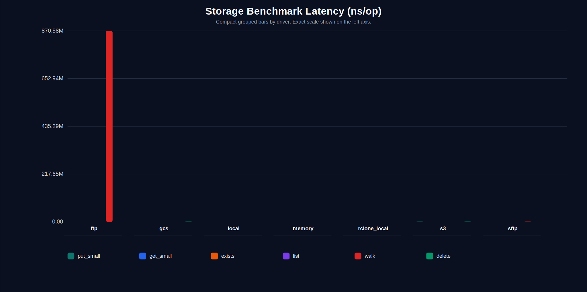
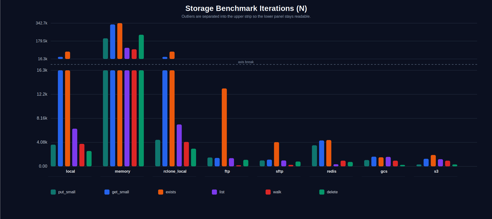
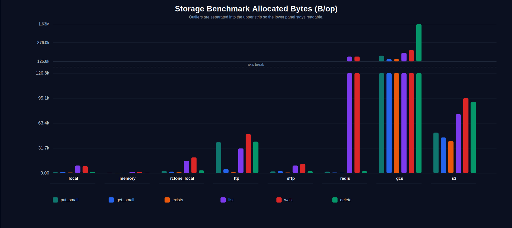
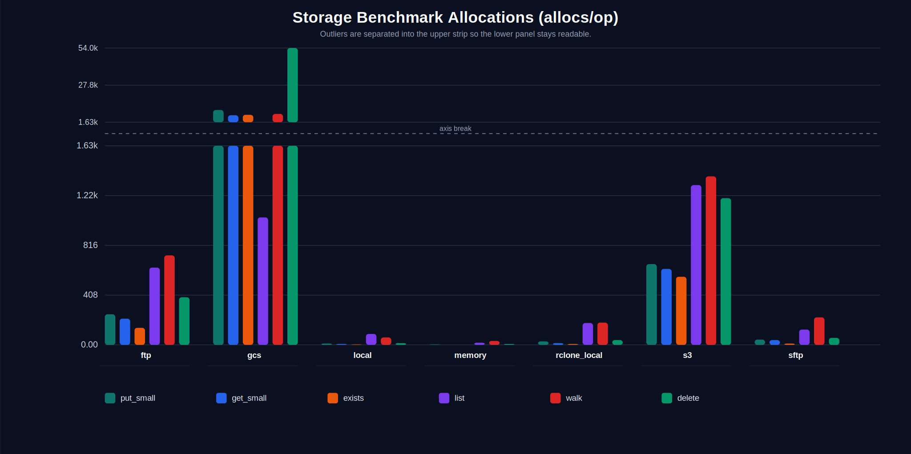

<p align="center">
  
</p>

<p align="center">
  One storage API for local disks, object stores, and remote filesystems.
</p>

<p align="center">
  <a href="https://pkg.go.dev/github.com/goforj/storage"></a>
  <a href="LICENSE"></a>
  <a href="https://github.com/goforj/storage/actions/workflows/ci.yml"></a>
  <a href="https://golang.org"></a>
  <a href="https://codecov.io/gh/goforj/storage"></a>
<!-- test-count:embed:start -->
  
  
<!-- test-count:embed:end -->
</p>

## Why

Applications often need to store files in different places:

- Local disks during development
- Object storage like S3 or GCS in production
- Remote filesystems like SFTP or FTP
- Cloud providers or custom remotes

Each backend has its own API and client library.

`storage` provides a **small, consistent interface** so your application code doesn't have to change when the backend changes.

## Driver Matrix

| Driver | Kind | Notes |
| ---: | --- | --- |
|  | In-memory | Best zero-dependency backend for tests and ephemeral workflows. |
|  | Local filesystem | Good default for local development and tests. |
|  | Object storage | MinIO-backed integration coverage in the shared matrix. |
|  | Object storage | Emulator-backed integration coverage via fake-gcs-server. |
|  | Remote filesystem | Container-backed integration coverage in the shared matrix. |
|  | Remote filesystem | Embedded integration fixture in the shared matrix. |
|  | Object storage | Returns temporary links; external integration strategy still open. |
|  | Breadth driver | Depends on the underlying rclone remote; see the [rclone storage systems overview](https://rclone.org/overview/). |

## Install

Root module:

```bash
go get github.com/goforj/storage
```

Then add the driver modules you need, for example:

```bash
go get github.com/goforj/storage/driver/localstorage
go get github.com/goforj/storage/driver/memorystorage
go get github.com/goforj/storage/driver/s3storage
go get github.com/goforj/storage/driver/gcsstorage
go get github.com/goforj/storage/driver/sftpstorage
go get github.com/goforj/storage/driver/ftpstorage
go get github.com/goforj/storage/driver/dropboxstorage
go get github.com/goforj/storage/driver/rclonestorage
```

## Usage

Choose the construction style that fits your application:
- Use a driver constructor like `localstorage.New(...)` when you want a single backend directly.
- Use `storage.Build(...)` when you want one backend through the shared `storage` API.
- Use `storage.New(...)` when you want multiple named disks managed from config.

All storage operations also expose `*Context` equivalents for deadlines and cancellation. The default methods use `context.Background()`.

### Common operations

```go
package main

import (
    "errors"
    "fmt"
    "log"

    "github.com/goforj/storage"
    "github.com/goforj/storage/driver/localstorage"
)

func main() {
    disk, err := storage.Build(localstorage.Config{
        Remote: "/tmp/storage",
    })
    if err != nil {
        log.Fatal(err)
    }

    // Put a file.
    if err := disk.Put("docs/readme.txt", []byte("hello")); err != nil {
        log.Fatal(err)
    }

    // Check whether the file exists.
    ok, err := disk.Exists("docs/readme.txt")
    if err != nil {
        log.Fatal(err)
    }
    fmt.Println(ok)
    // Output: true

    // Read the file back.
    data, err := disk.Get("docs/readme.txt")
    if err != nil {
        log.Fatal(err)
    }
    fmt.Println(string(data))
    // Output: hello

    // List the parent directory.
    entries, err := disk.List("docs")
    if err != nil {
        log.Fatal(err)
    }
    fmt.Println(entries[0].Path)
    // Output: docs/readme.txt

    // Delete the file.
    if err := disk.Delete("docs/readme.txt"); err != nil {
        log.Fatal(err)
    }

    // Ask the backend for an access URL when supported.
    url, err := disk.URL("docs/readme.txt")
    switch {
    case err == nil:
        fmt.Println(url)
    case errors.Is(err, storage.ErrUnsupported):
        fmt.Println("url generation unsupported")
        // Output: url generation unsupported
    default:
        log.Fatal(err)
    }
}
```

### Single-backend construction

```go
package main

import (
    "log"

    "github.com/goforj/storage"
    "github.com/goforj/storage/driver/localstorage"
)

func main() {
    // Build one disk through the shared storage API.
    built, err := storage.Build(localstorage.Config{
        Remote: "/tmp/storage",
        Prefix: "scratch",
    })
    if err != nil {
        log.Fatal(err)
    }

    // Or construct the driver directly.
    direct, err := localstorage.New(localstorage.Config{
        Remote: "/tmp/storage",
        Prefix: "scratch",
    })
    if err != nil {
        log.Fatal(err)
    }

    _, _ = built, direct
}
```

### Manager and named disks

```go
package main

import (
    "log"

    "github.com/goforj/storage"
    "github.com/goforj/storage/driver/localstorage"
    "github.com/goforj/storage/driver/s3storage"
)

func main() {
    // Build a manager with multiple named disks.
    mgr, err := storage.New(storage.Config{
        Default: "assets",
        Disks: map[storage.DiskName]storage.DriverConfig{
            "assets": localstorage.Config{
                Remote: "/tmp/storage",
                Prefix: "assets",
            },
            "uploads": s3storage.Config{
                Bucket:          "app-uploads",
                Region:          "us-east-1",
                Endpoint:        "http://localhost:9000",
                AccessKeyID:     "minioadmin",
                SecretAccessKey: "minioadmin",
                UsePathStyle:    true,
                Prefix:          "uploads",
            },
        },
    })
    if err != nil {
        log.Fatal(err)
    }

    // Resolve a disk by name.
    disk, err := mgr.Disk("assets")
    if err != nil {
        log.Fatal(err)
    }

    // Put a file into the disk.
    if err := disk.Put("hello.txt", []byte("hello")); err != nil {
        log.Fatal(err)
    }

    // Read the file back.
    data, err := disk.Get("hello.txt")
    if err != nil {
        log.Fatal(err)
    }

    _ = data // []byte("hello")
}
```

### Rclone

Use `rclonestorage` when you want to access rclone-backed remotes through the `storage` interface.

```go
package main

import (
    "log"

    "github.com/goforj/storage/driver/rclonestorage"
)

const rcloneConfig = `
[localdisk]
type = local
`

func main() {
    // Build an rclone-backed disk from inline rclone config.
    disk, err := rclonestorage.New(rclonestorage.Config{
        Remote:           "localdisk:/tmp/storage",
        Prefix:           "sandbox",
        RcloneConfigData: rcloneConfig,
    })
    if err != nil {
        log.Fatal(err)
    }

    // Put a file through rclone.
    if err := disk.Put("rclone.txt", []byte("hello")); err != nil {
        log.Fatal(err)
    }

    // List files from the disk root.
    entries, err := disk.List("")
    if err != nil {
        log.Fatal(err)
    }

    _ = entries // rclone.txt
}
```

See [`examples`](./examples) for runnable examples.

## Benchmarks

<!-- bench:embed:start -->

Benchmarks are rendered from `docs/bench` and compare the shared storage contract across representative backends.

Run the renderer with:

```bash
cd docs/bench
go test -tags benchrender . -run TestRenderBenchmarks -count=1 -v
```

Each chart sample uses a fixed measurement window per driver, so the ops chart remains meaningful without unbounded benchmark calibration.

Notes:

- `gcs` uses fake-gcs-server.
- `ftp` is excluded by default because the current driver opens a fresh connection per operation; include it with `BENCH_DRIVER=ftp`.
- `s3` and `sftp` use testcontainers; include them with `BENCH_WITH_DOCKER=1` or by explicitly setting `BENCH_DRIVER`.
- `rclone_local` measures rclone overhead on top of a local filesystem remote.

### Latency (ns/op)



### Iterations (N)



### Allocated Bytes (B/op)



### Allocations (allocs/op)


<!-- bench:embed:end -->

## Capability Matrix

| Driver | Stat | Copy | Move | Walk | URL | Context |
| ---: | :---: | :---: | :---: | :---: | :---: | :---: |
|  | ✓ | ✓ | ✓ | ✓ | ✗ | ✓ |
|  | ✓ | ✓ | ✓ | ✓ | ✗ | ✓ |
|  | ✓ | ✓ | ✓ | ✓ | ✓ | ✓ |
|  | ✓ | ✓ | ✓ | ✓ | ~ | ✓ |
|  | ✓ | ✓ | ✓ | ✓ | ✗ | ✓ |
|  | ✓ | ✓ | ✓ | ✓ | ✗ | ✓ |
|  | ✓ | ✓ | ✓ | ✓ | ✓ | ✓ |
|  | ✓ | ✓ | ✓ | ✓ | ~ | ✓ |

`~` indicates backend- or environment-dependent behavior. For example, GCS URL generation is unavailable in emulator mode and rclone URL support depends on the underlying remote.

## API reference

The API section below is autogenerated; do not edit between the markers.

<!-- api:embed:start -->

## API Index

| Group | Functions |
|------:|-----------|
| **Config** | [rclonestorage.LocalRemote](#rclonestorage-localremote) [rclonestorage.MustRenderLocal](#rclonestorage-mustrenderlocal) [rclonestorage.MustRenderS3](#rclonestorage-mustrenders3) [rclonestorage.RenderLocal](#rclonestorage-renderlocal) [rclonestorage.RenderS3](#rclonestorage-renders3) [rclonestorage.S3Remote](#rclonestorage-s3remote) |
| **Construction** | [Build](#build) [DriverConfig](#driverconfig) [DriverFactory](#driverfactory) [ResolvedConfig](#resolvedconfig) |
| **Context** | [BuildContext](#buildcontext) [ContextStorage](#contextstorage) [ContextStorage.CopyContext](#contextstorage-copycontext) [ContextStorage.DeleteContext](#contextstorage-deletecontext) [ContextStorage.ExistsContext](#contextstorage-existscontext) [ContextStorage.GetContext](#contextstorage-getcontext) [ContextStorage.ListContext](#contextstorage-listcontext) [ContextStorage.MoveContext](#contextstorage-movecontext) [ContextStorage.PutContext](#contextstorage-putcontext) [ContextStorage.StatContext](#contextstorage-statcontext) [ContextStorage.URLContext](#contextstorage-urlcontext) [ContextStorage.WalkContext](#contextstorage-walkcontext) |
| **Core** | [DiskName](#diskname) [Entry](#entry) [Storage](#storage) [Storage.Copy](#storage-copy) [Storage.Delete](#storage-delete) [Storage.Exists](#storage-exists) [Storage.Get](#storage-get) [Storage.List](#storage-list) [Storage.Move](#storage-move) [Storage.Put](#storage-put) [Storage.Stat](#storage-stat) [Storage.URL](#storage-url) [Storage.Walk](#storage-walk) |
| **Driver Config** | [dropboxstorage.Config](#dropboxstorage-config) [ftpstorage.Config](#ftpstorage-config) [gcsstorage.Config](#gcsstorage-config) [localstorage.Config](#localstorage-config) [memorystorage.Config](#memorystorage-config) [rclonestorage.Config](#rclonestorage-config) [s3storage.Config](#s3storage-config) [sftpstorage.Config](#sftpstorage-config) |
| **Driver Constructors** | [dropboxstorage.New](#dropboxstorage-new) [ftpstorage.New](#ftpstorage-new) [gcsstorage.New](#gcsstorage-new) [localstorage.New](#localstorage-new) [memorystorage.New](#memorystorage-new) [rclonestorage.New](#rclonestorage-new) [s3storage.New](#s3storage-new) [sftpstorage.New](#sftpstorage-new) |
| **Manager** | [Config](#config) [Manager](#manager) [Manager.Default](#manager-default) [Manager.Disk](#manager-disk) [New](#new) [RegisterDriver](#registerdriver) |
| **Paths** | [JoinPrefix](#joinprefix) [NormalizePath](#normalizepath) |


## Config

### <a id="rclonestorage-localremote"></a>rclonestorage.LocalRemote

LocalRemote defines a local backend configuration.

_Example: define a local remote_

```go
remote := rclonestorage.LocalRemote{Name: "local"}
fmt.Println(remote.Name)
// Output: local
```

_Example: define a local remote with all fields_

```go
remote := rclonestorage.LocalRemote{
	Name: "local",
}
fmt.Println(remote.Name)
// Output: local
```

### <a id="rclonestorage-mustrenderlocal"></a>rclonestorage.MustRenderLocal

MustRenderLocal panics on error.

```go
cfg := rclonestorage.MustRenderLocal(rclonestorage.LocalRemote{Name: "local"})
fmt.Println(cfg)
// Output:
// [local]
// type = local
```

### <a id="rclonestorage-mustrenders3"></a>rclonestorage.MustRenderS3

MustRenderS3 panics on error.

```go
cfg := rclonestorage.MustRenderS3(rclonestorage.S3Remote{
	Name:            "assets",
	Region:          "us-east-1",
	AccessKeyID:     "key",
	SecretAccessKey: "secret",
})
fmt.Println(cfg)
// Output:
// [assets]
// type = s3
// provider = AWS
// access_key_id = key
// secret_access_key = secret
// region = us-east-1
```

### <a id="rclonestorage-renderlocal"></a>rclonestorage.RenderLocal

RenderLocal returns ini-formatted rclone config for a local backend.

```go
cfg, _ := rclonestorage.RenderLocal(rclonestorage.LocalRemote{Name: "local"})
fmt.Println(cfg)
// Output:
// [local]
// type = local
```

### <a id="rclonestorage-renders3"></a>rclonestorage.RenderS3

RenderS3 returns ini-formatted rclone config content for a single S3 remote.

```go
cfg, _ := rclonestorage.RenderS3(rclonestorage.S3Remote{
	Name:            "assets",
	Region:          "us-east-1",
	AccessKeyID:     "key",
	SecretAccessKey: "secret",
})
fmt.Println(cfg)
// Output:
// [assets]
// type = s3
// provider = AWS
// access_key_id = key
// secret_access_key = secret
// region = us-east-1
```

### <a id="rclonestorage-s3remote"></a>rclonestorage.S3Remote

S3Remote defines parameters for constructing an rclone S3 remote.

_Example: define an s3 remote_

```go
remote := rclonestorage.S3Remote{
	Name:            "assets",
	Region:          "us-east-1",
	AccessKeyID:     "key",
	SecretAccessKey: "secret",
}
fmt.Println(remote.Name)
// Output: assets
```

_Example: define an s3 remote with all fields_

```go
remote := rclonestorage.S3Remote{
	Name:               "assets",
	Endpoint:           "http://localhost:9000", // default: ""
	Region:             "us-east-1",
	AccessKeyID:        "key",
	SecretAccessKey:    "secret",
	Provider:           "AWS",    // default: "AWS"
	PathStyle:          false,    // default: false
	BucketACL:          "private", // default: ""
	UseUnsignedPayload: false,    // default: false
}
fmt.Println(remote.Name)
// Output: assets
```

## Construction

### <a id="build"></a>Build

Build constructs a single storage backend from a typed driver config without
a Manager.

```go
fs, _ := storage.Build(localstorage.Config{
	Remote: "/tmp/storage-example",
	Prefix: "assets",
})
```

### <a id="driverconfig"></a>DriverConfig

DriverConfig is implemented by typed driver configs such as local.Config or
s3storage.Config. It is the public config boundary for Manager and Build.

```go
var cfg storage.DriverConfig = localstorage.Config{
	Remote: "/tmp/storage-config",
}
```

### <a id="driverfactory"></a>DriverFactory

DriverFactory constructs a Storage for a given normalized disk configuration.

```go
factory := storage.DriverFactory(func(ctx context.Context, cfg storage.ResolvedConfig) (storage.Storage, error) {
	return nil, nil
})
```

### <a id="resolvedconfig"></a>ResolvedConfig

ResolvedConfig is the normalized internal config passed to registered drivers.
Users should prefer typed driver configs and treat this as registry adapter
glue, not the primary construction API.

```go
factory := storage.DriverFactory(func(ctx context.Context, cfg storage.ResolvedConfig) (storage.Storage, error) {
	fmt.Println(cfg.Driver)
	// Output: memory
	return nil, nil
})

_, _ = factory(context.Background(), storage.ResolvedConfig{Driver: "memory"})
```

## Context

### <a id="buildcontext"></a>BuildContext

BuildContext constructs a single storage backend from a typed driver config
using the caller-provided context.

### <a id="contextstorage"></a>ContextStorage

ContextStorage exposes context-aware storage operations for cancellation and deadlines.
Use Storage for the common path and type-assert to ContextStorage when you need caller-provided context.

### <a id="contextstorage-copycontext"></a>ContextStorage.CopyContext

CopyContext copies the object at src to dst using the caller-provided context.

### <a id="contextstorage-deletecontext"></a>ContextStorage.DeleteContext

DeleteContext removes the object at path using the caller-provided context.

### <a id="contextstorage-existscontext"></a>ContextStorage.ExistsContext

ExistsContext reports whether an object exists at path using the caller-provided context.

### <a id="contextstorage-getcontext"></a>ContextStorage.GetContext

GetContext reads the object at path using the caller-provided context.

```go
disk, _ := storage.Build(localstorage.Config{
	Remote: "/tmp/storage-get-context",
})
_ = disk.Put("docs/readme.txt", []byte("hello"))

ctx, cancel := context.WithTimeout(context.Background(), time.Second)
defer cancel()

cs := disk.(storage.ContextStorage)
data, _ := cs.GetContext(ctx, "docs/readme.txt")
fmt.Println(string(data))
// Output: hello
```

### <a id="contextstorage-listcontext"></a>ContextStorage.ListContext

ListContext returns the immediate children under path using the caller-provided context.

### <a id="contextstorage-movecontext"></a>ContextStorage.MoveContext

MoveContext moves the object at src to dst using the caller-provided context.

### <a id="contextstorage-putcontext"></a>ContextStorage.PutContext

PutContext writes an object at path using the caller-provided context.

### <a id="contextstorage-statcontext"></a>ContextStorage.StatContext

StatContext returns the entry at path using the caller-provided context.

### <a id="contextstorage-urlcontext"></a>ContextStorage.URLContext

URLContext returns a usable access URL using the caller-provided context.

### <a id="contextstorage-walkcontext"></a>ContextStorage.WalkContext

WalkContext visits entries recursively using the caller-provided context.

## Core

### <a id="diskname"></a>DiskName

DiskName is a typed identifier for configured disks.

```go
const uploads storage.DiskName = "uploads"
fmt.Println(uploads)
// Output: uploads
```

### <a id="entry"></a>Entry

Entry represents an item returned by List.

Path is relative to the storage namespace, not an OS-native path.
Directory-like entries are listing artifacts, not a promise of POSIX-style
storage semantics.

```go
entry := storage.Entry{
	Path:  "docs/readme.txt",
	Size:  5,
	IsDir: false,
}
fmt.Println(entry.Path, entry.IsDir)
// Output: docs/readme.txt false
```

### <a id="storage"></a>Storage

Storage is the public interface for interacting with a storage backend.

Semantics:
- Put overwrites an existing object at the same path.
- List is one-level and non-recursive.
- List with an empty path lists from the disk root or prefix root.
- Walk is recursive.
- URL returns a usable access URL when the driver supports it.
- Copy overwrites the destination object when the backend supports copy semantics.
- Move relocates an object and may be implemented as copy followed by delete.
- Unsupported operations should return ErrUnsupported.

```go
var disk storage.Storage
disk, _ = storage.Build(localstorage.Config{
	Remote: "/tmp/storage-interface",
})
```

### <a id="storage-copy"></a>Storage.Copy

Copy copies the object at src to dst.

```go
disk, _ := storage.Build(localstorage.Config{
	Remote: "/tmp/storage-copy",
})
_ = disk.Put("docs/readme.txt", []byte("hello"))
_ = disk.Copy("docs/readme.txt", "docs/copy.txt")

data, _ := disk.Get("docs/copy.txt")
fmt.Println(string(data))
// Output: hello
```

### <a id="storage-delete"></a>Storage.Delete

Delete removes the object at path.

```go
disk, _ := storage.Build(localstorage.Config{
	Remote: "/tmp/storage-delete",
})
_ = disk.Put("docs/readme.txt", []byte("hello"))
_ = disk.Delete("docs/readme.txt")

ok, _ := disk.Exists("docs/readme.txt")
fmt.Println(ok)
// Output: false
```

### <a id="storage-exists"></a>Storage.Exists

Exists reports whether an object exists at path.

```go
disk, _ := storage.Build(localstorage.Config{
	Remote: "/tmp/storage-exists",
})
_ = disk.Put("docs/readme.txt", []byte("hello"))

ok, _ := disk.Exists("docs/readme.txt")
fmt.Println(ok)
// Output: true
```

### <a id="storage-get"></a>Storage.Get

Get reads the object at path.

```go
disk, _ := storage.Build(localstorage.Config{
	Remote: "/tmp/storage-get",
})
_ = disk.Put("docs/readme.txt", []byte("hello"))

data, _ := disk.Get("docs/readme.txt")
fmt.Println(string(data))
// Output: hello
```

### <a id="storage-list"></a>Storage.List

List returns the immediate children under path.

```go
disk, _ := storage.Build(localstorage.Config{
	Remote: "/tmp/storage-list",
})
_ = disk.Put("docs/readme.txt", []byte("hello"))

entries, _ := disk.List("docs")
fmt.Println(entries[0].Path)
// Output: docs/readme.txt
```

### <a id="storage-move"></a>Storage.Move

Move moves the object at src to dst.

```go
disk, _ := storage.Build(localstorage.Config{
	Remote: "/tmp/storage-move",
})
_ = disk.Put("docs/readme.txt", []byte("hello"))
_ = disk.Move("docs/readme.txt", "docs/archive.txt")

ok, _ := disk.Exists("docs/readme.txt")
fmt.Println(ok)
// Output: false
```

### <a id="storage-put"></a>Storage.Put

Put writes an object at path, overwriting any existing object.

```go
disk, _ := storage.Build(localstorage.Config{
	Remote: "/tmp/storage-put",
})
_ = disk.Put("docs/readme.txt", []byte("hello"))
fmt.Println("stored")
// Output: stored
```

### <a id="storage-stat"></a>Storage.Stat

Stat returns the entry at path.

```go
disk, _ := storage.Build(localstorage.Config{
	Remote: "/tmp/storage-stat",
})
_ = disk.Put("docs/readme.txt", []byte("hello"))

entry, _ := disk.Stat("docs/readme.txt")
fmt.Println(entry.Path, entry.Size)
// Output: docs/readme.txt 5
```

### <a id="storage-url"></a>Storage.URL

URL returns a usable access URL when the driver supports it.

_Example: request an object url_

```go
disk, _ := storage.Build(s3storage.Config{
	Bucket: "uploads",
	Region: "us-east-1",
})

url, _ := disk.URL("docs/readme.txt")
```

_Example: handle unsupported url generation_

```go
disk, _ := storage.Build(localstorage.Config{
	Remote: "/tmp/storage-url",
})

_, err := disk.URL("docs/readme.txt")
fmt.Println(errors.Is(err, storage.ErrUnsupported))
// Output: true
```

### <a id="storage-walk"></a>Storage.Walk

Walk visits entries recursively when the backend supports it.

```go
disk, _ := storage.Build(localstorage.Config{
	Remote: "/tmp/storage-walk",
})

err := disk.Walk("", func(entry storage.Entry) error {
	fmt.Println(entry.Path)
	return nil
})
fmt.Println(errors.Is(err, storage.ErrUnsupported))
// Output: true
```

## Driver Config

### <a id="dropboxstorage-config"></a>dropboxstorage.Config

Config defines a Dropbox-backed storage disk.

_Example: define dropbox storage config_

```go
cfg := dropboxstorage.Config{
	Token: "token",
}
```

_Example: define dropbox storage config with all fields_

```go
cfg := dropboxstorage.Config{
	Token:  "token",
	Prefix: "uploads", // default: ""
}
```

### <a id="ftpstorage-config"></a>ftpstorage.Config

Config defines an FTP-backed storage disk.

_Example: define ftp storage config_

```go
cfg := ftpstorage.Config{
	Host:     "127.0.0.1",
	User:     "demo",
	Password: "secret",
}
```

_Example: define ftp storage config with all fields_

```go
cfg := ftpstorage.Config{
	Host:               "127.0.0.1",
	Port:               21,        // default: 21
	User:               "demo",    // default: ""
	Password:           "secret",  // default: ""
	TLS:                false,     // default: false
	InsecureSkipVerify: false,     // default: false
	Prefix:             "uploads", // default: ""
}
```

### <a id="gcsstorage-config"></a>gcsstorage.Config

Config defines a GCS-backed storage disk.

_Example: define gcs storage config_

```go
cfg := gcsstorage.Config{
	Bucket: "uploads",
}
```

_Example: define gcs storage config with all fields_

```go
cfg := gcsstorage.Config{
	Bucket:          "uploads",
	CredentialsJSON: "{...}",              // default: ""
	Endpoint:        "http://127.0.0.1:0", // default: ""
	Prefix:          "assets",             // default: ""
}
```

### <a id="localstorage-config"></a>localstorage.Config

Config defines local storage rooted at a filesystem path.

_Example: define local storage config_

```go
cfg := localstorage.Config{
	Remote: "/tmp/storage-local",
	Prefix: "sandbox",
}
```

_Example: define local storage config with all fields_

```go
cfg := localstorage.Config{
	Remote: "/tmp/storage-local",
	Prefix: "sandbox", // default: ""
}
```

### <a id="memorystorage-config"></a>memorystorage.Config

Config defines an in-memory storage disk.

_Example: define memory storage config_

```go
cfg := memorystorage.Config{}
```

_Example: define memory storage config with all fields_

```go
cfg := memorystorage.Config{
	Prefix: "sandbox", // default: ""
}
```

### <a id="rclonestorage-config"></a>rclonestorage.Config

Config defines an rclone-backed storage disk.

_Example: define rclone storage config_

```go
cfg := rclonestorage.Config{
	Remote: "local:",
	Prefix: "sandbox",
}
```

_Example: define rclone storage config with all fields_

```go
cfg := rclonestorage.Config{
	Remote:           "local:",
	Prefix:           "sandbox",                  // default: ""
	RcloneConfigPath: "/path/to/rclone.conf",     // default: ""
	RcloneConfigData: "[local]\ntype = local\n",  // default: ""
}
```

### <a id="s3storage-config"></a>s3storage.Config

Config defines an S3-backed storage disk.

_Example: define s3 storage config_

```go
cfg := s3storage.Config{
	Bucket: "uploads",
	Region: "us-east-1",
}
```

_Example: define s3 storage config with all fields_

```go
cfg := s3storage.Config{
	Bucket:          "uploads",
	Endpoint:        "http://localhost:9000", // default: ""
	Region:          "us-east-1",
	AccessKeyID:     "minioadmin", // default: ""
	SecretAccessKey: "minioadmin", // default: ""
	UsePathStyle:    true,         // default: false
	UnsignedPayload: false,        // default: false
	Prefix:          "assets",     // default: ""
}
```

### <a id="sftpstorage-config"></a>sftpstorage.Config

Config defines an SFTP-backed storage disk.

_Example: define sftp storage config_

```go
cfg := sftpstorage.Config{
	Host:     "127.0.0.1",
	User:     "demo",
	Password: "secret",
}
```

_Example: define sftp storage config with all fields_

```go
cfg := sftpstorage.Config{
	Host:                  "127.0.0.1",
	Port:                  22,            // default: 22
	User:                  "demo",        // default: "root"
	Password:              "secret",      // default: ""
	KeyPath:               "/path/id_ed25519",      // default: ""
	KnownHostsPath:        "/path/known_hosts",     // default: ""
	InsecureIgnoreHostKey: false,         // default: false
	Prefix:                "uploads",     // default: ""
}
```

## Driver Constructors

### <a id="dropboxstorage-new"></a>dropboxstorage.New

New constructs Dropbox-backed storage using the official SDK.

```go
fs, _ := dropboxstorage.New(dropboxstorage.Config{
	Token: "token",
})
```

### <a id="ftpstorage-new"></a>ftpstorage.New

New constructs FTP-backed storage using jlaffaye/ftp.

```go
fs, _ := ftpstorage.New(ftpstorage.Config{
	Host:     "127.0.0.1",
	User:     "demo",
	Password: "secret",
})
```

### <a id="gcsstorage-new"></a>gcsstorage.New

New constructs GCS-backed storage using cloud.google.com/go/storage.

```go
fs, _ := gcsstorage.New(gcsstorage.Config{
	Bucket: "uploads",
})
```

### <a id="localstorage-new"></a>localstorage.New

New constructs local storage rooted at cfg.Remote with an optional prefix.

```go
fs, _ := localstorage.New(localstorage.Config{
	Remote: "/tmp/storage-local",
	Prefix: "sandbox",
})
```

### <a id="memorystorage-new"></a>memorystorage.New

New constructs in-memory storage.

```go
fs, _ := memorystorage.New(memorystorage.Config{
	Prefix: "sandbox",
})
```

### <a id="rclonestorage-new"></a>rclonestorage.New

New constructs an rclone-backed storage. All disks share a single config path.

_Example: rclone storage_

```go
fs, _ := rclonestorage.New(rclonestorage.Config{
	Remote: "local:",
	Prefix: "sandbox",
})
```

_Example: rclone storage with inline config_

```go
fs, _ := rclonestorage.New(rclonestorage.Config{
	Remote: "localdisk:/tmp/storage",
	RcloneConfigData: `

[localdisk]
type = local
`,

})
```

### <a id="s3storage-new"></a>s3storage.New

New constructs S3-backed storage using AWS SDK v2.

```go
fs, _ := s3storage.New(s3storage.Config{
	Bucket: "uploads",
	Region: "us-east-1",
})
```

### <a id="sftpstorage-new"></a>sftpstorage.New

New constructs SFTP-backed storage using ssh and pkg/sftp.

```go
fs, _ := sftpstorage.New(sftpstorage.Config{
	Host:     "127.0.0.1",
	User:     "demo",
	Password: "secret",
})
```

## Manager

### <a id="config"></a>Config

Config defines named disks using typed driver configs.

```go
cfg := storage.Config{
	Default: "local",
	Disks: map[storage.DiskName]storage.DriverConfig{
		"local": localstorage.Config{Remote: "/tmp/storage-manager"},
	},
}
```

### <a id="manager"></a>Manager

Manager holds named storage disks.

```go
mgr, _ := storage.New(storage.Config{
	Default: "local",
	Disks: map[storage.DiskName]storage.DriverConfig{
		"local": localstorage.Config{Remote: "/tmp/storage-manager"},
	},
})
```

### <a id="manager-default"></a>Manager.Default

Default returns the default disk or panics if misconfigured.

```go
mgr, _ := storage.New(storage.Config{
	Default: "local",
	Disks: map[storage.DiskName]storage.DriverConfig{
		"local": localstorage.Config{Remote: "/tmp/storage-default"},
	},
})

fs := mgr.Default()
fmt.Println(fs != nil)
// Output: true
```

### <a id="manager-disk"></a>Manager.Disk

Disk returns a named disk or an error if it does not exist.

```go
mgr, _ := storage.New(storage.Config{
	Default: "local",
	Disks: map[storage.DiskName]storage.DriverConfig{
		"local":   localstorage.Config{Remote: "/tmp/storage-default"},
		"uploads": localstorage.Config{Remote: "/tmp/storage-uploads"},
	},
})

fs, _ := mgr.Disk("uploads")
fmt.Println(fs != nil)
// Output: true
```

### <a id="new"></a>New

New constructs a Manager and eagerly initializes all disks.

```go
mgr, _ := storage.New(storage.Config{
	Default: "local",
	Disks: map[storage.DiskName]storage.DriverConfig{
		"local":  localstorage.Config{Remote: "/tmp/storage-local"},
		"assets": localstorage.Config{Remote: "/tmp/storage-assets", Prefix: "public"},
	},
})
```

### <a id="registerdriver"></a>RegisterDriver

RegisterDriver makes a driver available to the Manager. It panics on duplicate registrations.

```go
storage.RegisterDriver("memory", func(ctx context.Context, cfg storage.ResolvedConfig) (storage.Storage, error) {
	return nil, nil
})
```

## Paths

### <a id="joinprefix"></a>JoinPrefix

JoinPrefix combines a disk prefix with a path using slash separators.

```go
fmt.Println(storage.JoinPrefix("assets", "logo.svg"))
// Output: assets/logo.svg
```

### <a id="normalizepath"></a>NormalizePath

NormalizePath cleans a user path, normalizes separators, and rejects attempts
to escape the disk root or prefix root.

The empty string and root-like inputs normalize to the logical root.

```go
p, _ := storage.NormalizePath(" /avatars//user-1.png ")
fmt.Println(p)
// Output: avatars/user-1.png
```
<!-- api:embed:end -->

## Contributing

Shared contract tests live in `storagetest`.

Centralized integration coverage lives in `integration` and runs the same contract across supported backends.
That centralized matrix is the authoritative integration path for the repository.

Current fixture types in the centralized matrix:
- testcontainers: `s3`, `sftp`
- emulator: `gcs`
- embedded/local fixtures: `local`, `ftp`, `rclone_local`

Common contributor commands:

```bash
go test ./...
```

```bash
cd integration
go test -tags=integration ./all -count=1
```

Run a single integration backend:

```bash
cd integration
INTEGRATION_DRIVER=gcs go test -tags=integration ./all -count=1
```

Make targets:

```bash
make test
make examples-test
make coverage
make integration
make integration-driver gcs
```
